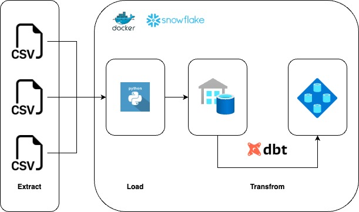
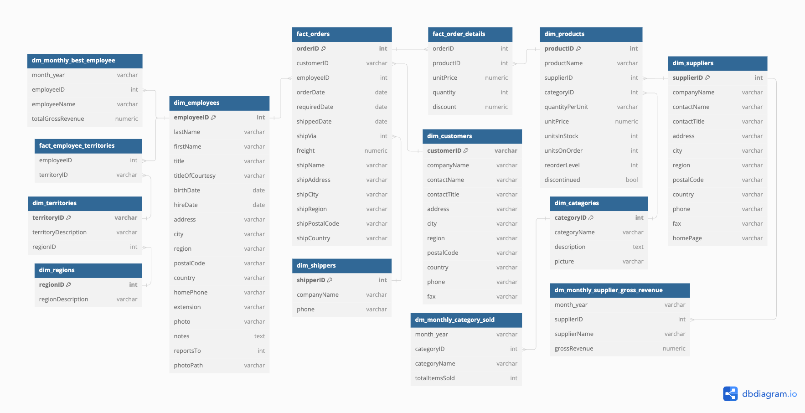

# ELT Data Pipeline with Snowflake, dbt, and Docker

## Table of Contents

1. [Project Overview](#project-overview)
2. [Architecture](#architecture)
3. [Data Warehouse Schema](#data-warehouse-schema)
4. [Prerequisites](#prerequisites)
5. [Setup and Installation](#setup-and-installation)
   - [Clone the Repository](#clone-the-repository)
   - [Environment Variables](#environment-variables)
   - [Docker Setup](#docker-setup)
6. [Usage](#usage)
   - [Running the Pipeline](#running-the-pipeline)
   - [Testing](#testing)
7. [Project Structure](#project-structure)

## Project Overview

This project is designed to demonstrate an ELT (Extract, Load, Transform) data pipeline using Snowflake as the data warehouse, dbt (data build tool) for transformations, and Docker for containerization. The pipeline extracts data from source systems, loads it into Snowflake, and then transforms it using dbt models.

## Architecture



1. **Extract**: Data is extracted from source systems.
2. **Load**: Extracted data is loaded into Snowflake.
3. **Transform**: Data is transformed in Snowflake using dbt models.

## Data Warehouse Schema



The provided schema represents a relational database designed to store and manage data related to territories, suppliers, shippers, regions, products, customers, categories, employees, orders, and various monthly metrics. [source](https://github.com/graphql-compose/graphql-compose-examples/tree/master/examples/northwind/data/csv)

## Prerequisites

- Docker
- Docker Compose
- Snowflake account
- dbt CLI
- Git

## Setup and Installation

### Clone the Repository

```bash
git clone https://github.com/lanaahm/elt-snowflake.git
cd elt-snowflake
```

### Environment Variables

Create a `.env` file in the project root and add the following environment variables:

```env
SNOWFLAKE_ACCOUNT=your_snowflake_account
SNOWFLAKE_USER=your_snowflake_user
SNOWFLAKE_PASSWORD=your_snowflake_password
SNOWFLAKE_ROLE=your_snowflake_role
SNOWFLAKE_WAREHOUSE=your_snowflake_warehouse
SNOWFLAKE_DATABASE=your_snowflake_database
SNOWFLAKE_SCHEMA=your_snowflake_schema
```

### Docker Setup

Build and run the Docker containers:

```bash
docker-compose build
```

This command will build the Docker images in the docker-compose.yml file.

## Usage

### Running the Pipeline

To run the entire ELT pipeline:

1. Extract data and load it into Snowflake:

```bash
docker-compose run --rm snowflake_elt
```

2. Debug dbt connection

```bash
docker-compose run --rm snowflake_dbt debug
```

3. Run dbt model:

```bash
docker-compose run --rm snowflake_dbt run
```

4. Generate dbt docs:

```bash
docker-compose run --rm snowflake_dbt docs generate
```

5. Serve dbt docs:

```bash
docker-compose run --rm snowflake_dbt docs serve
```

### Testing

To run tests on the dbt models:

```bash
docker-compose run --rm snowflake_dbt test
```

## Project Structure

```
elt-snowflake/
│
├── snowflake_dbt/
│   ├── models/
│   ├── snapshots/
│   ├── target/
│   ├── tests/
│   ├── Dockerfile
│   ├── schema.yml
│   └── dbt_project.yml
│
├── snowflake_elt/
│   ├── .env
│   ├── config.py
│   ├── main.py
│   ├── Dockerfile
│   └── requirements.txt
│
├── .editorconfig
├── .gitignore
├── profiles.yml
├── docker-compose.yml
└── README.md

```

- elt-snowflake/: The root directory for the entire project.
- snowflake_dbt/: Directory containing all the dbt-related configurations and files.
  - models/: Directory for dbt models which define the structure of your data transformations.
  - snapshots/: Directory for dbt snapshots, which capture the state of your data at regular intervals.
  - target/: Directory where dbt compiles your SQL files and stores the output.
  - tests/: Directory for dbt tests, ensuring the correctness of your models.
  - Dockerfile: Dockerfile specific to the dbt service, for containerizing the dbt project.
  - schema.yml: YAML file defining the schema for dbt models and tests.
  - dbt_project.yml: Configuration file for the dbt project, specifying project settings and configurations.
- snowflake_elt/: Directory containing Python scripts for data extraction and loading.
  - .env: Environment variable definitions for the Python scripts, such as credentials and configuration settings.
  - config.py: Python configuration file, possibly containing settings and constants used in the ELT process.
  - main.py: Main Python script for executing the ELT pipeline.
  - Dockerfile: Dockerfile specific to the ELT service, for containerizing the ELT scripts.
  - requirements.txt: File listing Python dependencies required for the ELT process.
- .editorconfig: Configuration file for maintaining consistent coding styles across different editors and IDEs.
- .gitignore: File specifying which files and directories should be ignored by Git, preventing them from being committed to the repository.
- profiles.yml: Configuration file for dbt profiles, defining connection details for different environments (e.g., development, production).
- docker-compose.yml: Docker Compose configuration file for defining and running multi-container Docker applications, orchestrating the services defined in the project.
- README.md: Project documentation file, providing an overview of the project, setup instructions, and other relevant information.

_\*[checkout](https://github.com/lanaahm/elt-snowflake/blob/main/snowflake_dbt/README.md) the data mart results_
